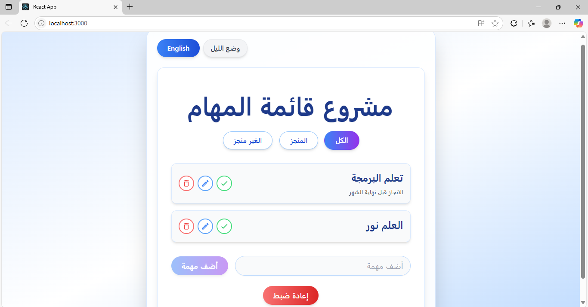

# To Do List App



## Demo

[View the live demo](https://adorable-sprite-02fa52.netlify.app/)

A simple and modern To Do List application built with React. It supports dark mode and bilingual interface (English/Arabic).

## Features

- Add, edit, and delete tasks
- Toggle between light and dark mode
- Switch between English and Arabic languages
- Responsive and clean UI

## Getting Started

### Prerequisites

- Node.js (v14 or higher recommended)
- npm (comes with Node.js)

### Installation

1. Clone the repository:
   ```bash
   git clone <repository-url>
   cd todolist
   ```
2. Install dependencies:
   ```bash
   npm install
   ```

### Running the App

Start the development server:

```bash
npm start
```

The app will open at [http://localhost:3000](http://localhost:3000).

## Project Structure

- `src/` - React components and app logic
- `public/` - Static assets and HTML template

## Customization

- You can edit the UI and features by modifying files in the `src/` directory.

## License

This project is for educational purposes.
